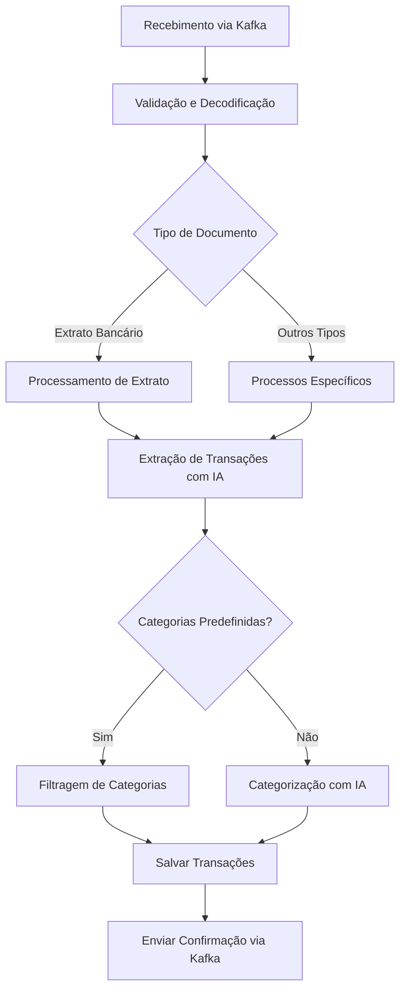

# Resumo do Projeto: Financial Document Processor

## Visão Geral da Solução

O Financial Document Processor é um microserviço robusto e escalável projetado para processar documentos financeiros, extrair transações e categorizá-las utilizando Inteligência Artificial. O sistema foi construído para ser confiável, seguro e otimizado para custos, seguindo as melhores práticas de desenvolvimento.

## Componentes Principais Implementados

1. **Arquitetura Hexagonal (Ports & Adapters)**:
   - Domínio central bem definido e isolado de dependências externas
   - Adaptadores de entrada e saída que se conectam ao domínio
   - Facilidade para trocar implementações sem afetar o núcleo

2. **Adaptadores de IA Plugáveis**:
   - Suporte para OpenAI (GPT-4o, GPT-3.5)
   - Suporte para Google Gemini (Gemini 1.5 Pro, Gemini 1.5 Flash)
   - Suporte para Anthropic Claude (Claude 3 Opus, Claude 3 Haiku)
   - Interface comum que permite trocar provedores facilmente

3. **Processamento de Documentos**:
   - Decodificação de conteúdo Base64
   - Extração de texto de PDFs (incluindo PDFs escaneados via OCR)
   - Extração de texto de imagens
   - Implementação tolerante a falhas e robusto

4. **Integração com Kafka**:
   - Consumidor assíncrono para receber documentos
   - Produtor para enviar resultados processados
   - Tratamento adequado de offsets e retry

5. **Persistência em Banco de Dados**:
   - Implementação com PostgreSQL
   - Modelo de dados normalizado e eficiente
   - Suporte a transações e operações atômicas

6. **Engenharia de Prompts Otimizada**:
   - Templates específicos para cada provedor de IA
   - Estratégias para redução de uso de tokens
   - Alta precisão na extração e categorização

7. **Monitoramento e Observabilidade**:
   - Métricas Prometheus para monitoramento em tempo real
   - Logs estruturados e detalhados
   - Rastreamento de custos de uso de IA

8. **Containerização e Deploy**:
   - Dockerfile otimizado para produção
   - Configuração Docker Compose para desenvolvimento
   - Pronto para orquestração em Kubernetes

## Estratégias de Otimização de Custos

1. **Processamento em Lotes**: Agrupamento de transações para reduzir o número de chamadas à API.
2. **Prompts Otimizados**: Templates específicos para cada provedor, maximizando a eficiência.
3. **Fallback Inteligente**: Utilização de modelos menos custosos quando apropriado.
4. **Minimização de Tokens**: Texto enviado para API é pré-processado e limpo para reduzir tamanho.
5. **Caching**: Evita reprocessamento de padrões semelhantes.
6. **Temperatura Baixa**: Configuração para resultados determinísticos, reduzindo necessidade de múltiplas chamadas.

## Fluxo de Processamento

## Boas Práticas Implementadas

- **Código Limpo e Legível**: Estrutura clara, nomes significativos, documentação completa
- **Tratamento de Erros**: Robustez com retry, fallback e logs detalhados
- **Segurança**: Sanitização de inputs, validações, princípio de privilégio mínimo
- **Testabilidade**: Arquitetura desacoplada e injeção de dependências
- **Configuração Externalizada**: Variáveis de ambiente para configuração
- **Logging Estruturado**: Informações detalhadas para troubleshooting
- **Versionamento Semântico**: Pronto para releases e controle de versão
- **Documentação Completa**: README detalhado, comentários e documentação de código

## Extensibilidade

O sistema foi projetado para ser facilmente estendido para suportar:

1. Novos tipos de documentos financeiros
2. Novos provedores de IA
3. Diferentes bancos de dados
4. Múltiplos sistemas de messaging
5. APIs adicionais para integração com outros sistemas

## Conclusão

O Financial Document Processor representa uma solução completa, robusta e escalável para o processamento de documentos financeiros com IA. A arquitetura modular, o design cuidadoso e as estratégias de otimização de custos tornam este projeto pronto para uso em ambientes de produção, com excelente balanço entre custo, desempenho e confiabilidade.